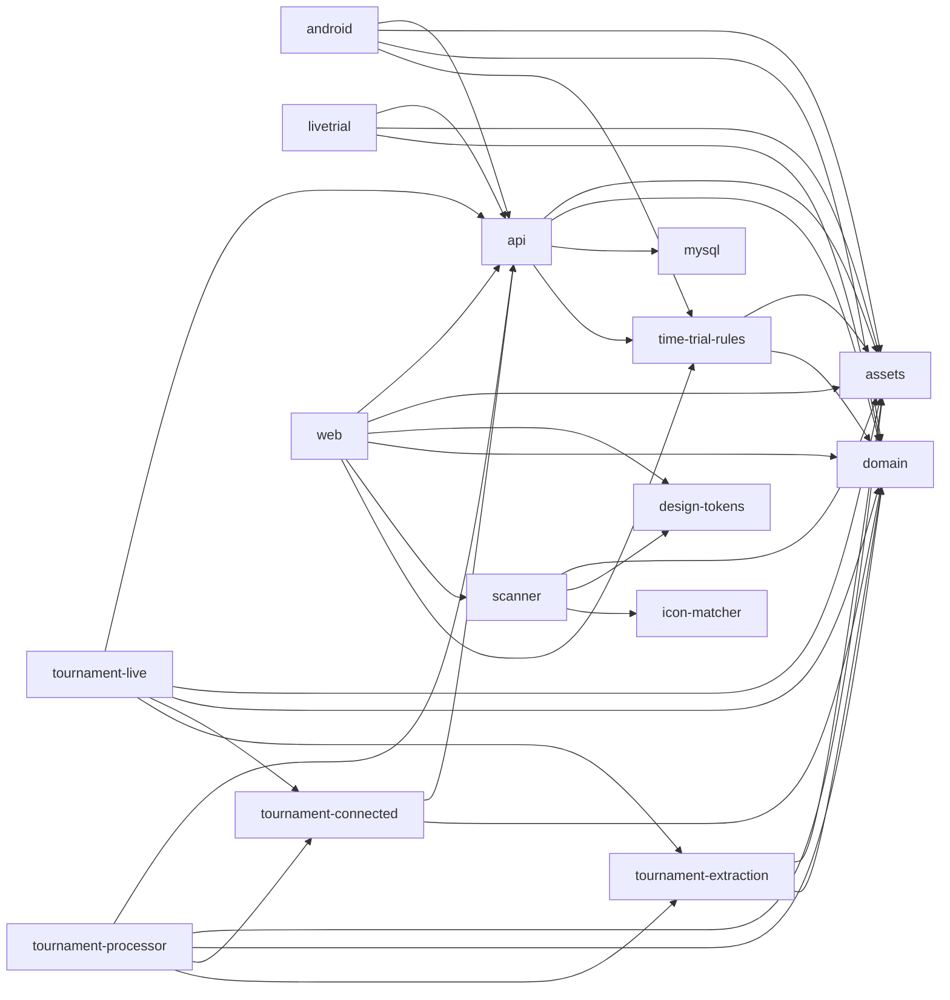

# Component dependency graph

Generated from `component-registry.json`; `python tooling/check_boundaries.py` verifies this view.

```mermaid
graph LR
    android[android]
    api[api]
    assets[assets]
    design_tokens[design-tokens]
    domain[domain]
    icon_matcher[icon-matcher]
    livetrial[livetrial]
    mysql[mysql]
    scanner[scanner]
    time_trial_rules[time-trial-rules]
    tournament_connected[tournament-connected]
    tournament_extraction[tournament-extraction]
    tournament_live[tournament-live]
    tournament_processor[tournament-processor]
    web[web]
    android --> api
    android --> assets
    android --> domain
    android --> time_trial_rules
    api --> assets
    api --> domain
    api --> mysql
    api --> time_trial_rules
    livetrial --> api
    livetrial --> assets
    livetrial --> domain
    scanner --> assets
    scanner --> design_tokens
    scanner --> icon_matcher
    time_trial_rules --> assets
    time_trial_rules --> domain
    tournament_connected --> api
    tournament_connected --> domain
    tournament_extraction --> assets
    tournament_extraction --> domain
    tournament_live --> api
    tournament_live --> assets
    tournament_live --> domain
    tournament_live --> tournament_connected
    tournament_live --> tournament_extraction
    tournament_processor --> api
    tournament_processor --> assets
    tournament_processor --> domain
    tournament_processor --> tournament_connected
    tournament_processor --> tournament_extraction
    web --> api
    web --> assets
    web --> design_tokens
    web --> domain
    web --> scanner
    web --> time_trial_rules
```
